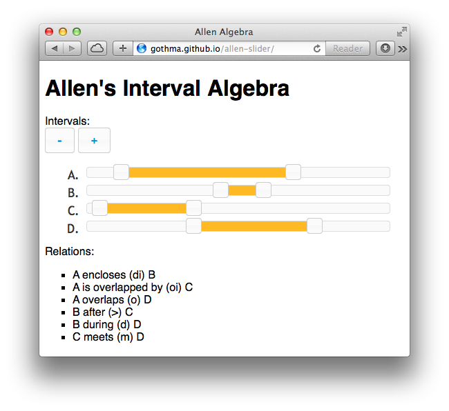

# Allen Slider
*A interval slider to understand Allen's interval algebra*

This applet aims to help thinking about and understanding [*Allens's interval algebra*](http://en.wikipedia.org/wiki/Allen's_interval_algebra)

## Where is it?
To see a running version just visit [gothma.github.io/allen-slider](http://gothma.github.io/allen-slider).

## How does it work?

* Add new intervals by pressing `+`
* Modify the intervals by grabbing the sliders
* See the according relations below
* Enjoy

## Known Bugs

* After 26 relations the intervals names don't fit the relations. But who uses 26 relations?
